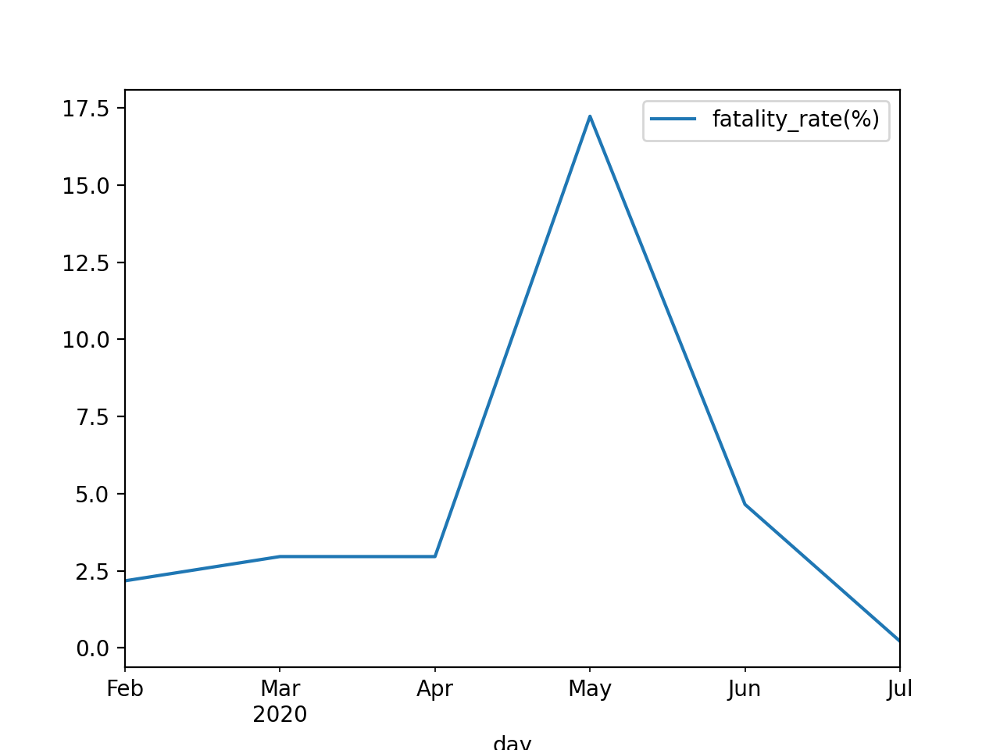
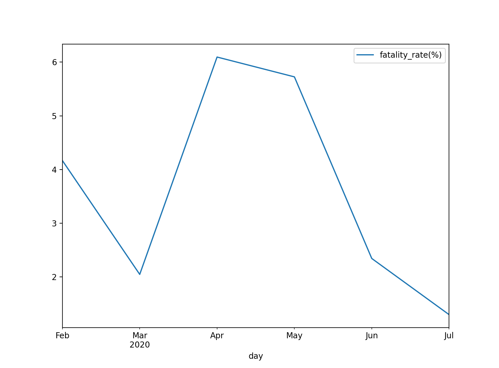

# Covid-19 fatality rate visualizer
I haven't seen case-fatality rate statistics on covid-19 websites except reserch reports.
This visualization program shows you monthly case-fatality rate.

If you change data source url on `main.py`, you can see your country's fatality rate.

## Visualization
### Japan fatality rate


### USA fatality rate



## How to install

    pip install -r requirements.txt

## How to run

    python main.py


## Data

### Japan
```
            new_case  new_death
day
2020-02-29     230.0        5.0
2020-03-31    1723.0       51.0
2020-04-30   12135.0      359.0
2020-05-31    2763.0      476.0
2020-06-30    1742.0       81.0
2020-07-31   15779.0       34.0
```

```
            fatality_rate(%)
day
2020-02-29          2.173913
2020-03-31          2.959954
2020-04-30          2.958385
2020-05-31         17.227651
2020-06-30          4.649828
2020-07-31          0.215476
```


## Source
- [Wikipedia](https://en.wikipedia.org/wiki/Template:COVID-19_pandemic_data)
- [About this data](https://support.google.com/websearch/answer/9814707?p=cvd19_statistics&hl=en-JP&visit_id=637318352693244221-1670221881&rd=1)
