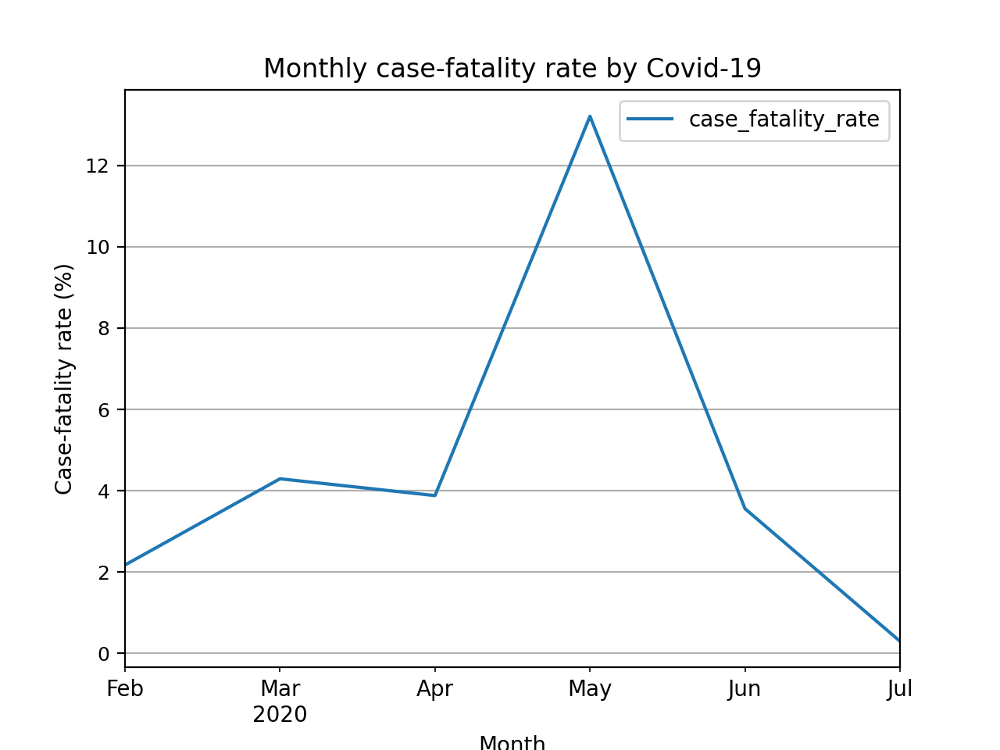
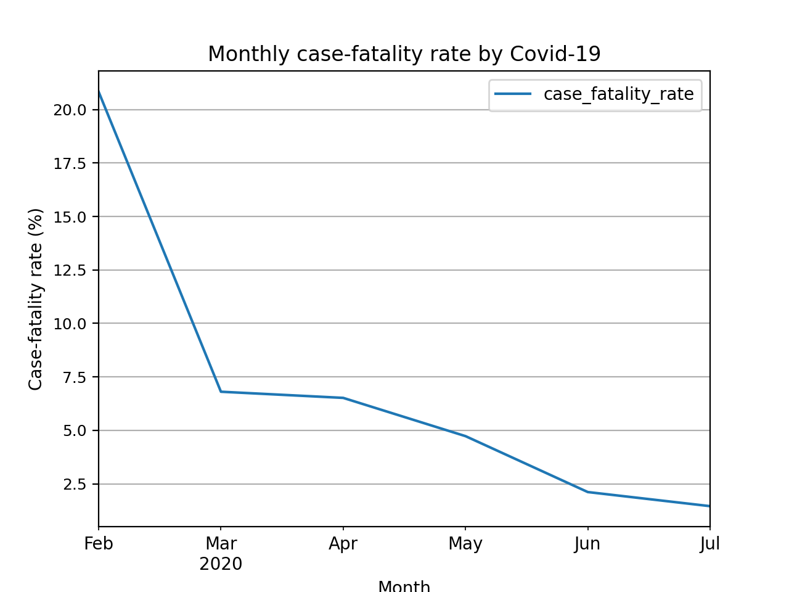

# Covid-19 fatality rate visualizer
I haven't seen case-fatality rate statistics on covid-19 websites except reserch reports.
This visualization program shows you monthly case-fatality rate.

If you change data source url on `main.py`, you can see your country's fatality rate.

## Visualization
### Japan fatality rate


### USA fatality rate


## How to install

    pip install -r requirements.txt

## How to run

    python main.py


## Data

### Japan

```
            new_case  new_death
day                            
2020-02-29     230.0        5.0
2020-03-31    1723.0       74.0
2020-04-30   12135.0      471.0
2020-05-31    2763.0      365.0
2020-06-30    1742.0       62.0
2020-07-31    9363.0       28.0
            case_fatality_rate
day                           
2020-02-29            2.173913
2020-03-31            4.294835
2020-04-30            3.881335
2020-05-31           13.210279
2020-06-30            3.559127
2020-07-31            0.299049
```

### United States

```
             new_case  new_death
day                             
2020-02-29       24.0        5.0
2020-03-31   185967.0    12655.0
2020-04-30   875037.0    57026.0
2020-05-31   713006.0    33711.0
2020-06-30   813983.0    17199.0
2020-07-31  1385152.0    20131.0
            case_fatality_rate
day                           
2020-02-29           20.833333
2020-03-31            6.804971
2020-04-30            6.516982
2020-05-31            4.728011
2020-06-30            2.112943
2020-07-31            1.453342
```


## Source
- [Wikipedia](https://en.wikipedia.org/wiki/Template:COVID-19_pandemic_data)
- [About this data](https://support.google.com/websearch/answer/9814707?p=cvd19_statistics&hl=en-JP&visit_id=637318352693244221-1670221881&rd=1)
